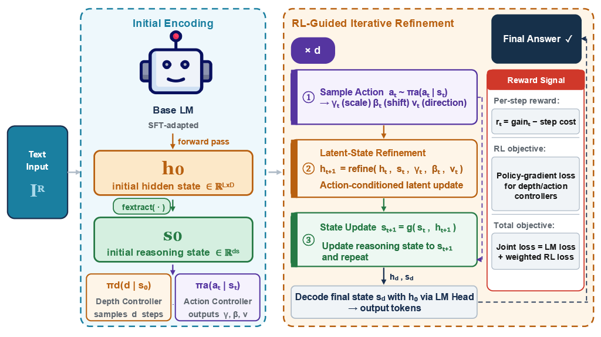

# Learning to Refine Hidden States for Reliable LLM Reasoning

[](https://www.python.org/)
[](https://pytorch.org/)
[](LICENSE)

---

## Overview

Large language models show strong reasoning ability, but their internal reasoning process can remain unstable in complex multi-step settings. Early hidden-state errors may propagate and lead to incorrect predictions.

This is a latent refinement framework that uses reinforcement learning to update hidden representations before decoding. Instead of relying on explicit chain-of-thought generation, it controls the reasoning process inside the latent space. This helps improve reasoning stability and accuracy while reducing inference overhead.

<p align="center">
  
</p>

---

## Key Features

- **Latent Reasoning Control** — Iteratively refines hidden representations before any output token is generated, enabling fine-grained control over internal reasoning trajectories.
- **Adaptive Depth Controller** — Dynamically selects the number of refinement steps based on input complexity, allocating more computation to harder examples.
- **Action Controller** — Learns the direction and magnitude of each refinement step via a policy-gradient objective.
- **Efficient Inference** — Achieves competitive performance at 1× inference time, compared to CoT (64.9×) and Self-Consistency CoT (116.9×).
- **Broad Coverage** — Evaluated on medical QA, mathematical reasoning, multi-hop QA, and open-ended generation tasks.

---

## Method

ReLAR augments a pretrained language model with a compact latent reasoning state and two learned controllers:

```
Input → Base LM Forward Pass → h₀ (initial hidden state)
                                   ↓
                             fextract(·)
                                   ↓
                             s₀ (reasoning state)
                            /              \
                    πd(d | s₀)         πa(aₜ | sₜ)
                  Depth Controller    Action Controller
                  (samples d steps)   (outputs γ, β, v)
                            \              /
                        RL-Guided Iterative Refinement
                          h₀ → h₁ → ... → h_d
                                   ↓
                             Decode → Final Answer
```

### Refinement Step

At each step $t$, the action controller samples:

$$a_t = (\gamma_t, \beta_t, \mathbf{v}_t) \sim \pi_a(a_t \mid s_t)$$

where $\mathbf{v}_t$ is the unit update direction and $\gamma_t, \beta_t$ determine the effective magnitude. The hidden state is updated as:

$$h_{t+1} = f_{\text{refine}}(h_t,\, s_t,\, \gamma_t,\, \beta_t,\, \mathbf{v}_t)$$

### RL Reward

Per-step reward is defined via ground-truth log-likelihood improvement:

$$r_t = \Delta_t - c_d, \quad \Delta_t = \log p_\theta(y^* \mid x, s_{t+1}) - \log p_\theta(y^* \mid x, s_t)$$

### Training Objective

$$\mathcal{L}_{\text{total}} = \mathcal{L}_{\text{LM}} + \alpha_{\text{RL}} \cdot \mathcal{L}_{\text{RL}}$$

---

## Results

### Reasoning Benchmarks (Table 1)

| Model | PubMedQA 0-shot (Acc/F1) | PubMedQA 5-shot (Acc/F1) | GSM8K 0-shot (Acc/pass@5) | GSM8K 5-shot (Acc/pass@5) | GSM-Hard 0-shot (Acc/pass@5) | GSM-Hard 5-shot (Acc/pass@5) | HotpotQA 0-shot (Acc/F1) | HotpotQA 5-shot (Acc/F1) |
|---|---|---|---|---|---|---|---|---|
| LLaMA-2-7B | 53.47 / 46.83 | 58.34 / 51.67 | 23.82 / 31.47 | 30.56 / 48.73 | 22.34 / 27.83 | 29.47 / 38.57 | 27.34 / 38.47 | 39.82 / 52.63 |
| Mistral-7B-v0.3 | 59.83 / 52.47 | 64.57 / 57.83 | 40.63 / 67.84 | 57.84 / 79.36 | 24.83 / 31.47 | 38.64 / 46.28 | 35.63 / 48.74 | 47.82 / 61.35 |
| Falcon-7B | 44.83 / 37.47 | 49.64 / 42.83 | 17.84 / 24.47 | 25.63 / 36.82 | 14.47 / 19.83 | 21.28 / 27.64 | 22.47 / 31.83 | 30.84 / 41.64 |
| Gemma-7B | 56.84 / 49.73 | 61.47 / 54.28 | 47.63 / 68.84 | 56.28 / 76.43 | 22.47 / 29.63 | 31.84 / 39.47 | 31.82 / 43.47 | 42.64 / 56.83 |
| Mistral-7B-Instruct | 63.28 / 55.84 | 67.47 / 60.83 | 53.47 / 74.83 | 63.82 / 82.47 | 27.83 / 34.47 | 36.28 / 44.83 | 41.47 / 55.28 | 50.83 / 64.47 |
| Llama-3-8B-Instruct | 68.47 / 62.83 | 71.83 / 66.47 | **75.82 / 83.47** | **80.64 / 88.23** | 34.47 / 42.83 | 43.28 / 51.84 | 48.83 / 63.47 | 56.47 / 71.83 |
| Qwen2.5-7B | 58.92 / 51.47 | 63.84 / 56.23 | 73.47 / 81.83 | 79.28 / 87.64 | 39.83 / **47.28** | 47.64 / 54.83 | 44.83 / 58.47 | 52.64 / 66.83 |
| Qwen2.5-Med-7B | 60.12 / 52.48 | 65.09 / 57.34 | 64.41 / 73.85 | 71.35 / 80.63 | 36.47 / 43.82 | 42.82 / 50.03 | 41.81 / 55.13 | 50.18 / 64.15 |
| Med42-Mistral-7B | 69.14 / 60.53 | 71.38 / 63.24 | 46.53 / 72.84 | 54.82 / 81.47 | 30.63 / 38.47 | 38.84 / 47.23 | 32.47 / 45.83 | 39.64 / 53.47 |
| Med42-Llama3-8B | 70.65 / 70.74 | 73.87 / 72.25 | 71.89 / 80.14 | 77.06 / 85.80 | 35.62 / 42.93 | 43.49 / 51.63 | 46.23 / 61.59 | 54.01 / 69.82 |
| MedGemma-4B | 72.45 / 68.52 | 74.19 / 70.71 | 61.18 / 70.32 | 66.71 / 75.29 | 26.03 / 33.20 | 34.63 / 42.08 | 39.48 / 53.29 | 46.91 / 60.05 |
| **Ours** | **77.67 / 72.54** | **79.23 / 74.17** | 68.45 / 78.23 | 71.28 / 84.20 | **41.06** / 45.58 | **48.57 / 52.12** | **57.50 / 75.23** | **59.64 / 76.15** |

All results in 0-shot setting. See paper for 5-shot results.

### Open-Ended Generation (Table 2)

| Model | CommonGen (BERTScore / ROUGE-L) | WritingPrompts (BERTScore / ROUGE-L) |
|---|---|---|
| Llama-3-8B-Instruct | 0.918 / 33.94 | 0.869 / 8.74 |
| Qwen2.5-7B | 0.912 / 31.42 | 0.864 / 7.94 |
| **ReLAR (Ours)** | **0.934 / 38.92** | **0.878 / 11.47** |

### Inference-Time Efficiency (Table 5, PubMedQA, Gemma-2B)

| Method | Acc. | F1 | Relative Time |
|---|---|---|---|
| SFT only | 58.10 | 33.54 | 0.9× |
| CoT | 64.68 | 54.33 | 64.9× |
| SC-CoT | 72.83 | 65.31 | 116.9× |
| **ReLAR (Ours)** | **77.67** | **72.54** | **1.0×** |

---

## Project Structure

```
ReLAR-main/
├── train.py              # Entry point for training and evaluation
├── trainer.py            # HiddenRLTrainer: full training loop
├── dataset.py            # Dataset loading and collation
├── models/
│   ├── __init__.py
│   ├── state_extractor.py    # InitialStateExtractor (fextract)
│   ├── depth_controller.py   # DepthController (πd)
│   ├── action_controller.py  # ActionController (πa)
│   ├── hidden_refiner.py     # HiddenRefiner (frefine)
│   ├── decode_bridge.py      # DecodeBridge (fdecode)
│   └── value_critic.py       # ValueCritic (baseline for RL)
└── LICENSE
```

---

## Installation

```bash
git clone https://github.com/<your-username>/ReLAR.git
cd ReLAR
pip install -r requirements.txt
```

**Requirements:**
- Python ≥ 3.8
- PyTorch ≥ 2.0
- Transformers (Hugging Face)
- NumPy, Matplotlib

---

## Quick Start

### Training

```bash
export HF_TOKEN=<your_huggingface_token>

python train.py
```

The default configuration uses `google/gemma-2-2b-it` as the backbone. Key hyperparameters can be adjusted directly in `train.py`:

```python
trainer = HiddenRLTrainer(
    model_name="google/gemma-2-2b-it",
    beta=0.1,           # KL penalty weight
    max_depth=3,        # Maximum refinement steps
    depth_cost=0.02,    # Per-step computation cost cd
    entropy_bonus=0.01, # Entropy bonus λH
    depth_rl_weight=0.15,
    critic_weight=0.2,
    action_dim=64,      # Action space dimension
    state_dim=256,      # Latent reasoning state dimension
)

trainer.train(
    output_dir="./output",
    epochs=50,
    batch_size=2,
    lr=1e-6,
    max_length=512,
    val_ratio=0.1,
    seed=42,
)
```

### Evaluation

```python
trainer.evaluate(
    split="val",
    max_samples=200,
    max_length=512,
    val_ratio=0.1,
    seed=42,
    max_gen_tokens=64,
)
```

<!-- 
### Using a Different Backbone

Replace `model_name` with any Hugging Face causal LM:

```python
# LLaMA-1.1B
trainer = HiddenRLTrainer(model_name="meta-llama/Llama-3.2-1B-Instruct", ...)

# Qwen-3B
trainer = HiddenRLTrainer(model_name="Qwen/Qwen2.5-3B-Instruct", ...)
```
-->

---

## Ablation Summary (Table 3, Gemma-2B on PubMedQA)

| Configuration | Acc. | F1 |
|---|---|---|
| No Refinement (SFT only) | 55.02 | 33.54 |
| Static Refinement (fixed depth, no direction) | 73.01 | 60.84 |
| Adaptive Depth only | 76.72 | 57.85 |
| Adaptive Direction only (single-step) | 68.90 | 57.12 |
| **Adaptive Depth + Direction (Ours)** | **77.67** | **72.54** |

Both the adaptive depth controller and the action controller contribute independently; combining them achieves the best results.
<!-- 
---

## Citation

If you find this work useful, please cite:

```bibtex
@inproceedings{relar2025,
  title     = {ReLAR: Reinforcement-Guided Latent Refinement for Controllable LLM Reasoning},
  booktitle = {TODO: update with actual venue},
  year      = {2025},
}
```
-->
<!-- 
---
## License

This project is licensed under the [MIT License](LICENSE).
-->
